# Java Development Environment for macOS

For a smooth and easy Java development experience some prerequisites are required.
Unfortunately an IDE - Integrated Development environment for developing a sophisticated team project is not enough.
The following tool stack is supporting you doing various tasks more easily.

- [Install a simple Text Editor (Sublime, BBEdit or similar)](#install-a-simple-text-editor-sublime-bbedit-or-similar)
- [Install XCode](#install-xcode)
- [Install the XCode Command Line Tools](#install-the-xcode-command-line-tools)
- [Install Homebrew](#install-homebrew)
- [Install various JDK's (8, 11, 17)](#install-various-jdks-8-11-17-or-later)
- [Install a JDK Console Switch](#install-a-jdk-console-switch)
- [Compile and run a Java Application from the Command Line](#compile-and-run-a-java-application-from-the-command-line)
- [Install Maven](#install-maven)
- [Install Gradle](#install-gradle)
- [Install IntelliJ Ultimate Edition](#install-intellij-ultimate-edition)
- [First start of IntelliJ Ultimate](#first-start-of-intellij-ultimate)
- [Install additional IntelliJ Plugins](#install-additional-intellij-plugins)
- [Install the Java FX Scene Builder](#install-the-java-fx-scene-builder)

<br/>

## Install a simple Text Editor (Sublime, BBEdit or similar)

We need an easy to use and fast a loadable editor for editing some simple text files. Here some options:

- [Atom](https://atom.io/ "Atom")
- [Sublime Text ](https://www.sublimetext.com/ "Sublime Text")
- [Bare Bones Software | Download BBEdit 13](https://www.barebones.com/products/bbedit/download.html "Bare Bones Software | Download BBEdit 13")

BBedit will fall back to the community edition after 30 days (which is ok)!


## Install XCode

 XCode provides developers a unified workflow for user interface design, coding, testing, and debugging.

Open the App Store and search for XCode.

[Xcode 12 - Apple Developer](https://developer.apple.com/xcode/ "Xcode 12 - Apple Developer")

Install this software. It may take a while to install it.
Please start XCode after installation... you will be asked installing some additional components.


## Install the XCode Command Line Tools

The Command Line Tools Package is a small self-contained
package available for a download separately from Xcode
 that allows you to do command line development in macOS.
It consists of the macOS SDK and command-line tools such as Clang,
which are installed at this location: `/Library/Developer/CommandLineTools`.

Open a terminal window and enter the following command. The installation will take some minutes.

```
xcode-select --install
```


After the installation verify if git is available:

```
git --version
```

Your output should look like:

```
509 mbach:~ $ git --version
git version 2.24.3 (Apple Git-128)
```

<br/>

## Install Homebrew

Homebrew is a package manager for macOS which lets you install free and
open-source software using your terminal.
You’ll use Homebrew to install developer tools like Maven, Gradle, Python, Ruby, Node.js, and more.

Check the availability of home brew: just type ```brew -v``` in the terminal.
If you have it will respond with the version number installed.

If home brew is not available yet, you should install it now:

```
/bin/bash -c "$(curl -fsSL https://raw.githubusercontent.com/Homebrew/install/HEAD/install.sh)" 
```

<br/>

After the installation verify the installation:

```
brew --version
```

Your output should look like:

```
510 mbach:~ $ brew --version
Homebrew 2.5.6
Homebrew/homebrew-core (git revision 9c655; last commit 2020-10-16)
Homebrew/homebrew-cask (git revision 98c2a; last commit 2020-10-16)
```

<br/>

## Install various JDK's (8, 11, 17 or later)

The Java Development Kit (JDK) is one of three core technology packages used in
Java programming, along with the JVM (Java Virtual Machine)
and the JRE (Java Runtime Environment).
It's important to differentiate between these three technologies,
as well as understanding how they're connected:

- The JVM is the Java platform component that executes programs.
- The JRE is the on-disk part of Java that creates the JVM.

The JDK allows developers to create Java programs that can be executed and
run by the JVM and JRE.


The last _JDK_ including _Java Fx_ is the **JDK 8 (LTS) from Oracle**. In order to download the Oracle
_JDK's_ you need to create an account at Oracle:

- [Oracle Sign in / Sing up](https://www.oracle.com/)

Here you can download the various JDK's:

- [Java SE - Downloads | Oracle Technology Network | Oracle](https://www.oracle.com/java/technologies/javase-downloads.html )

Or download the Adopt Open JDK's (the OpenJDK8 has fewer packages - _no Java Fx_ - than the Oracle JDK8):

- [AdoptOpenJDK - Open source, prebuilt OpenJDK binaries](https://adoptopenjdk.net/ )

<br/>

Verify the current Java version. Open a new terminal:

```
java -version
```

Your output should look like (depending on your Java version):

```
513 mbach:~ $ java -version
java version "17.0.1" 2021-10-19 LTS
Java(TM) SE Runtime Environment (build 17.0.1+12-LTS-39)
Java HotSpot(TM) 64-Bit Server VM (build 17.0.1+12-LTS-39, mixed mode, sharing)
514 mbach:~ $ 
```

<br/>

## Install a JDK Console Switch

This tutorial will guide you on how to switch JAVA versions on your macOS device.
This can be useful for working with apps which don’t work with updated JAVA versions.
First, you need to make sure you have multiple JAVA versions installed.

<br/>

1. Open a new Terminal window and input:

```
/usr/libexec/java_home -V
```

<br/>

Your output should look like (depending on your installed JDK's):

```
Matching Java Virtual Machines (7):
    17,     x86_64:	"Java SE 17"	    /Library/Java/JavaVirtualMachines/jdk-17.jdk/Contents/Home
    14.0.1, x86_64:	"Java SE 14.0.1"	/Library/Java/JavaVirtualMachines/jdk-14.0.1.jdk/Contents/Home
    13.0.2, x86_64:	"Java SE 13.0.2"	/Library/Java/JavaVirtualMachines/jdk-13.0.2.jdk/Contents/Home
    11.0.1, x86_64:	"Java SE 11.0.1"	/Library/Java/JavaVirtualMachines/jdk-11.0.1.jdk/Contents/Home
    9.0.1,  x86_64:	"Java SE 9.0.1"	    /Library/Java/JavaVirtualMachines/jdk-9.0.1.jdk/Contents/Home
    1.8.0_251, x86_64:	"Java SE 8"	    /Library/Java/JavaVirtualMachines/jdk1.8.0_251.jdk/Contents/Home
```

<br/>

For the command switch we need to include four or more lines (depending on the number of JDK's) to your  **.bash_profile** file.
This file is in your _user home folder_.
If you cannot see the hidden files in your _user home folder_: select a folder and type the combination `[cmd] + [shift] + [.]`:

The illustration shows how to find the file **.bash_profile**.

<br/>

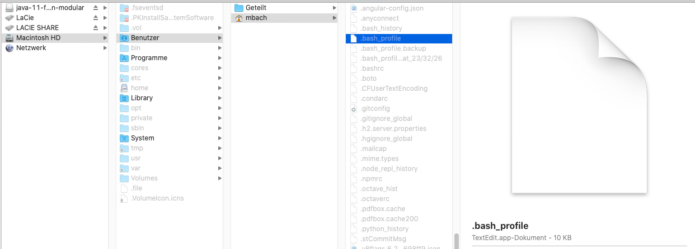

<br/>

If the file **.bash_profile** is not available... please create it. Use a text editor like sublime or BBEdit and add the following lines:

```
#########################
# JDK Console Switch
alias j8="export JAVA_HOME=`/usr/libexec/java_home -v 1.8`; java -version; echo `/usr/libexec/java_home -v 1.8` ;  "
alias j11="export JAVA_HOME=`/usr/libexec/java_home -v 11`; java -version; echo `/usr/libexec/java_home -v 11` ; "
alias j14="export JAVA_HOME=`/usr/libexec/java_home -v 14`; java -version; echo `/usr/libexec/java_home -v 14` ; "
alias j17="export JAVA_HOME=`/usr/libexec/java_home -v 17`; java -version; echo `/usr/libexec/java_home -v 17` ; "

#########################
# Default Java = JDK 17
# j17
```

<br/>

Open a new terminal and verify the command switch. You must use a new terminal
since this terminal did not read the new configuration from **.bash_profile**)!
Alternatively you can refresh the existing terminal with ```source ~/.bash_profile```.

Enter the commands:

```
j8
j17
j11
```
<br/>

Your output should look like:

```
503 mbach:~ $ j8
java version "1.8.0_251"
Java(TM) SE Runtime Environment (build 1.8.0_251-b08)
Java HotSpot(TM) 64-Bit Server VM (build 25.251-b08, mixed mode)
/Library/Java/JavaVirtualMachines/jdk1.8.0_251.jdk/Contents/Home

504 mbach:~ $ j17
java version "17.0.1" 2021-10-19 LTS
Java(TM) SE Runtime Environment (build 17.0.1+12-LTS-39)
Java HotSpot(TM) 64-Bit Server VM (build 17.0.1+12-LTS-39, mixed mode, sharing)
/Library/Java/JavaVirtualMachines/jdk-17.jdk/Contents/Home

505 mbach:~ $ j11
java version "11.0.1" 2018-10-16 LTS
Java(TM) SE Runtime Environment 18.9 (build 11.0.1+13-LTS)
Java HotSpot(TM) 64-Bit Server VM 18.9 (build 11.0.1+13-LTS, mixed mode)
/Library/Java/JavaVirtualMachines/jdk-11.0.1.jdk/Contents/Home
506 mbach:~ $ 

```
<br/>

## Compile and run a Java Application from the Command Line

1. Create an empty folder e.g. helloworld
2. Create a new file `HelloWorld.java`. Copy the following content to this file:

```java
public class HelloWorld {
    public static void main(String[] args) {
        System.out.println("Hello World");
    }
}
```

3. Create a _.class_ file by using the _javac_ compiler:

```
javac HelloWorld.java
```

4. Run the compiled _.class_ file:

```
 java HelloWorld
```

Your output should look like:

```
λ java HelloWorld.java
Hello World
```


## Install Maven

Apache Maven is a software project management and comprehension tool.
Based on the concept of a project object model (POM), Maven can manage a project's build,
reporting and documentation from a central piece of information.

Open a terminal and enter:

```
brew install maven
```

Open another terminal after installation and enter:

```
mvn --version
```

Your output should look like:

```
507 mbach:~ $  mvn --version
Apache Maven 3.6.3 (cecedd343002696d0abb50b32b541b8a6ba2883f)
Maven home: /usr/local/Cellar/maven/3.6.3_1/libexec
Java version: 11.0.1, vendor: Oracle Corporation, runtime: /Library/Java/JavaVirtualMachines/jdk-11.0.1.jdk/Contents/Home
Default locale: de_CH, platform encoding: UTF-8
OS name: "mac os x", version: "10.15.7", arch: "x86_64", family: "mac"
```


## Install Gradle

Gradle is an open-source build automation tool
that is designed to be flexible enough to build almost any type of software.

Open a terminal and enter:

```
brew install gradle
```

Open another terminal after installation and enter:

```
gradle --version
```

Your output should look like:

```
508 mbach:~ $ gradle --version

------------------------------------------------------------
Gradle 6.5.1
------------------------------------------------------------

Build time:   2020-06-30 06:32:47 UTC
Revision:     66bc713f7169626a7f0134bf452abde51550ea0a

Kotlin:       1.3.72
Groovy:       2.5.11
Ant:          Apache Ant(TM) version 1.10.7 compiled on September 1 2019
JVM:          11.0.1 (Oracle Corporation 11.0.1+13-LTS)
OS:           Mac OS X 10.15.7 x86_64
```


## Install IntelliJ Ultimate Edition

IntelliJ IDEA Ultimate is a superset of most IntelliJ platform-based IDEs.
If the bundled language plugins are enabled, it includes support for all
technologies that are available within our more specific IDEs,
such as PyCharm, WebStorm, PHPStorm, and so on.

Please create an account at Jet Brains. Use your academic mail address:

- [Free Education Licences](https://www.jetbrains.com/de-de/community/education/#students)

Download IntelliJ Ultimate:

- [Download IntelliJ IDEA](https://www.jetbrains.com/de-de/idea/download/#section=mac)

After downloading and installing... start IntelliJ and register your version with your account.

<br/>

## First start of IntelliJ Ultimate

The goal of this step is doing a simple _Hello World_ console application.

<br/>

### 1. New Project

Click on _New Project_ in the _Welcome Dialog_.

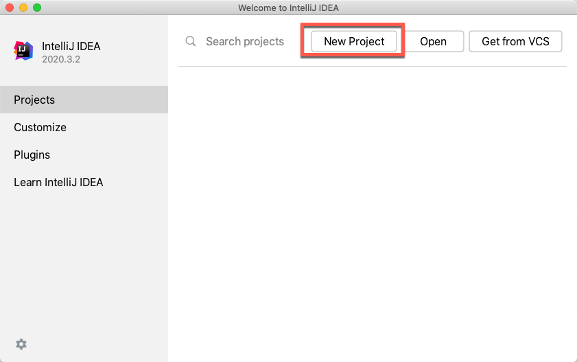

<br/>

### 2. Add all installed JDK's to IntelliJ

Make sure all your installed JDK's are know to IntelliJ.

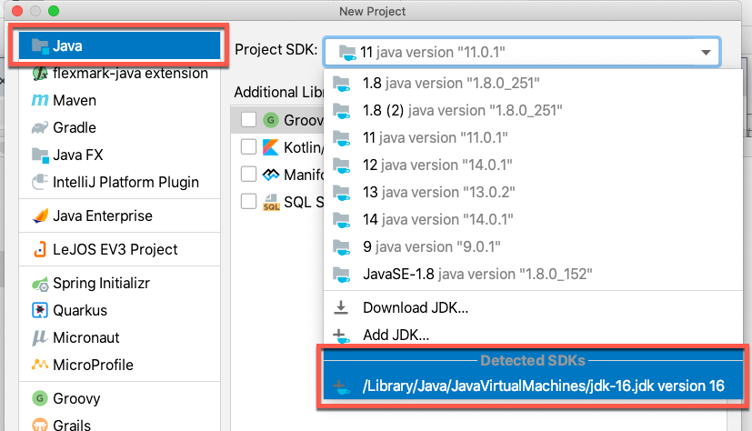

<br/>

### 3. Create a Command Line App

We will create a simple _Hello World_ command line app.

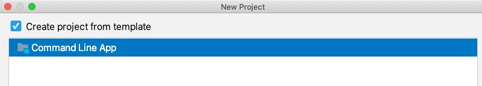

<br/>

### 4. Define the project name

Define the project name, the project location on your computer and the base package name.

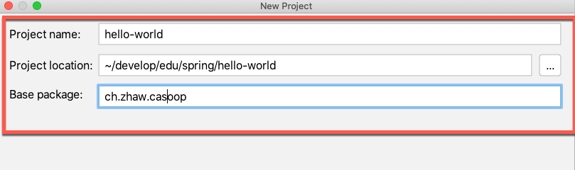

<br/>

### 5. Add some Source Code to the Main Class and Run Main

Add this code fragment to your Main class:

```java
        String temp = "Hello World";
        System.out.println(temp);
```

You can run your code by opening the context menu and clicking on _Run 'Main'_:

<br/>

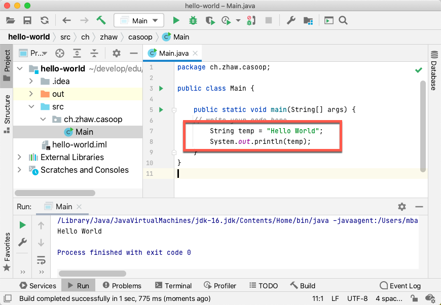

<br/>

### 6. Set a breakpoint and Debug Main

Click on the left grey area and set a breakpoint.
ou can debug your code by opening the context menu and clicking on _Debug 'Main'_:

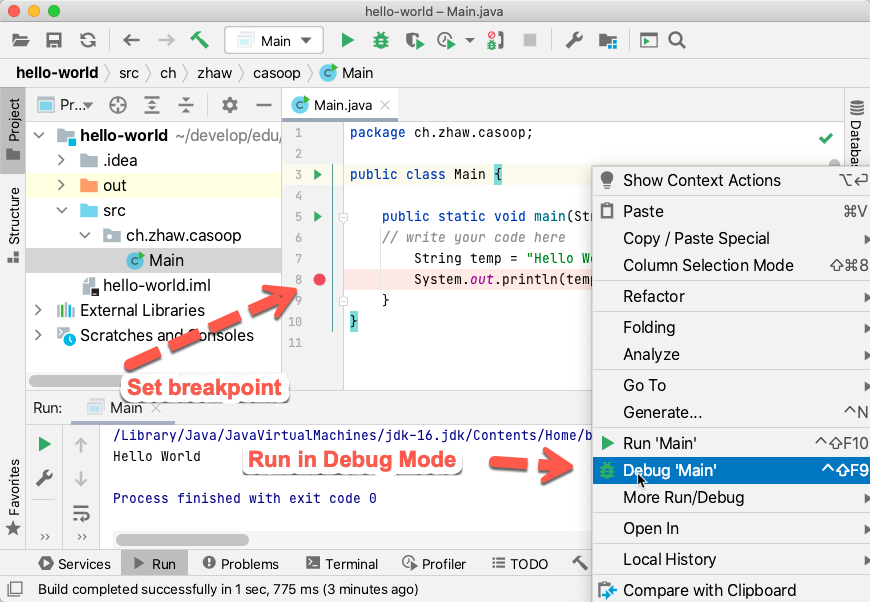

<br/>

### 7. Inspect Variables at the Breakpoint

The program execution stops at the breakpoint. Inspect the variable _temp_.
You can proceed in single step mode by choosing _Step Over_ or _Step Into_.
With a click to _Resume Program_ the execution continues.

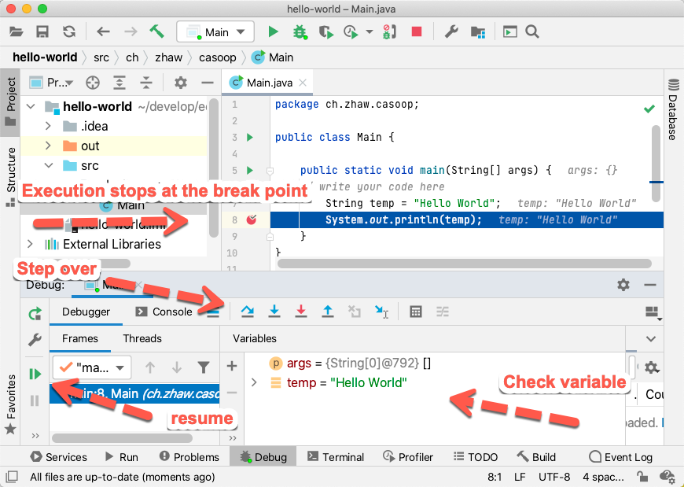

<br/>

### 8. Change the JDK of your Hello World Project

Open the IntelliJ _Project Structure Dialog_ through _Menu -> File -> Project Structure_:

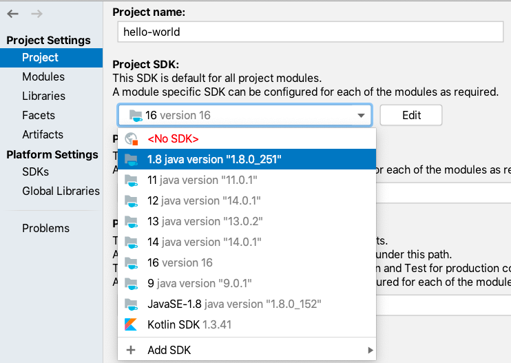

<br/>

Check the change and run with a different JDK:

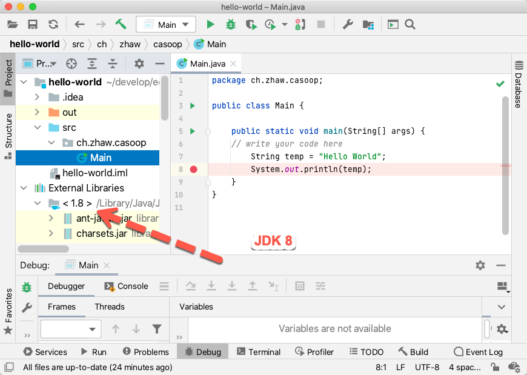

<br/>

## Install additional IntelliJ Plugins

For the installation of plugins you should open the Intellij preferences and filter for plugins:

<br/>

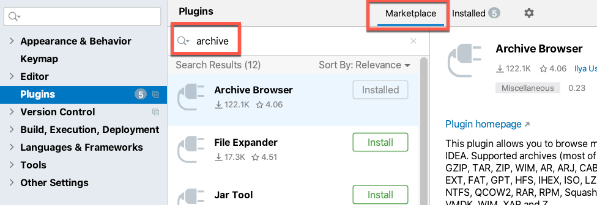

 <br/>


The following plugins might help you during development:

- [Archive Browser](https://plugins.jetbrains.com/plugin/9491-archive-browser)
- [Decompile and Attach](https://plugins.jetbrains.com/plugin/8047-decompile-and-attach)
- [JPA Buddy](https://plugins.jetbrains.com/plugin/15075-jpa-buddy)
- [Maven Helper](https://plugins.jetbrains.com/plugin/7179-maven-helper)
- [Swagger](https://plugins.jetbrains.com/plugin/8347-swagger)
- [FXML Manager](https://plugins.jetbrains.com/plugin/14854-fxmlmanager)


## Install the Java FX Scene Builder

Open the Gluon web page: download and install the latest version og Scene Builder.

[Scene Builder - Gluon](https://gluonhq.com/products/scene-builder/ "Scene Builder - Gluon")

Open the preferences' dialog in intelliJ and create a link to the installed software.

<br/>

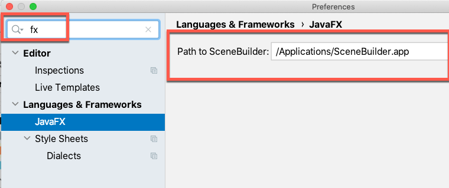
