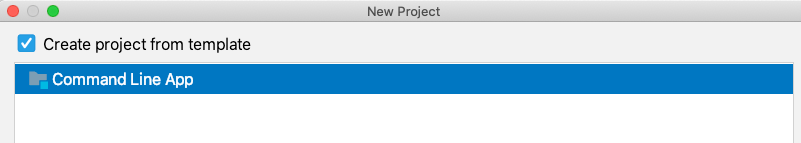
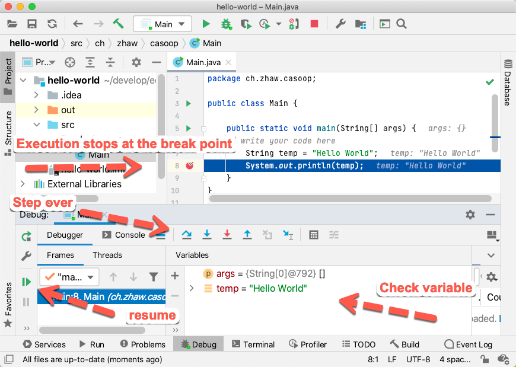
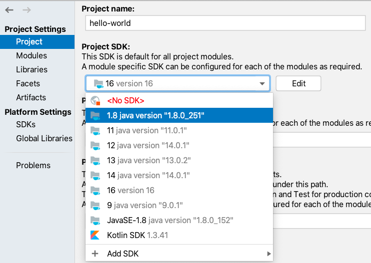
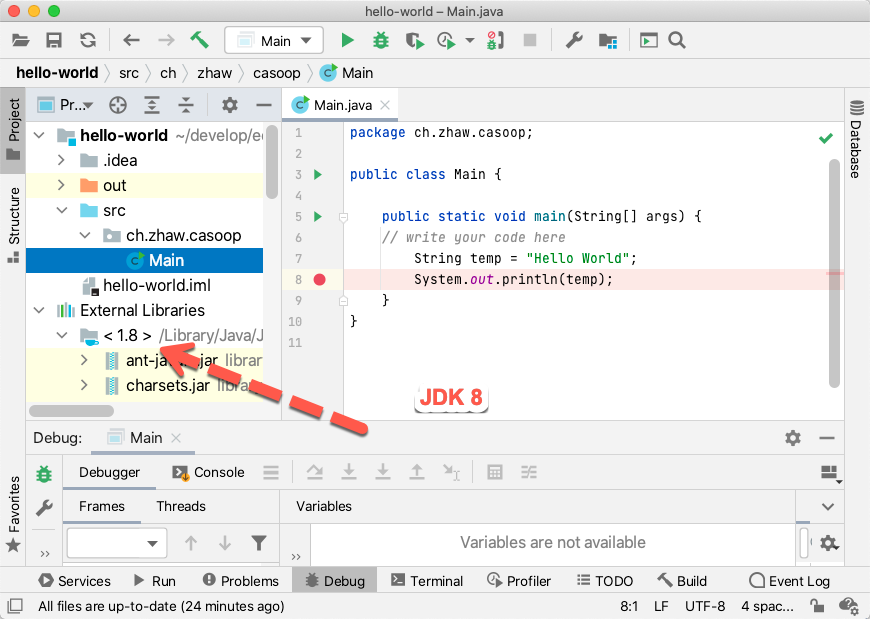

# Java Development Environment for Windows


 [This Tutorial as YouTube Video](https://youtu.be/hIfoSy82a_U)

For a smooth and easy Java development experience some prerequisites are required.
Unfortunately an IDE - Integrated Development environment for developing a sophisticated team project is not enough.
The following tool stack is supporting you doing various tasks more easily.

- [Install an Archiver and Extractor Tool](#install-an-archiver-and-extractor-tool)
- [Install a simple Text Editor (notepad++)](#install-a-simple-text-editor-notepad)
- [Install Cmder with Git](#install-cmder-with-git)
- [Install various JDK's (8, 11, 17 or later)](#install-various-jdks-8-11-17-or-later)
- [Install a JDK Console Switch](#install-a-jdk-console-switch)
- [Compile and run a Java Application from the Command Line](#compile-and-run-a-java-application-from-the-command-line)
- [Install Maven](#install-maven)
- [Install Gradle](#install-gradle)
- [Install IntelliJ Ultimate Edition](#install-intellij-ultimate-edition)
- [First start of IntelliJ Ultimate](#first-start-of-intellij-ultimate)
- [Add the Installation Path of Git in IntelliJ](#add-the-installation-path-of-git-in-intellij)
- [Configure Cmder in IntelliJ](#configure-cmder-in-intellij)
- [Install additional IntelliJ Plugins](#install-additional-intellij-plugins)
- [Install the Java FX Scene Builder](#install-the-java-fx-scene-builder)

<br/>

## Install an Archiver and Extractor Tool

There are several options of powerful archivers and extractors on Windows:

- WinRAR
- 7Zip
- WinZip

### WinRAR

WinRAR is a powerful archiver extractor tool, and can open all popular file formats.
Make sure the default archive format is zip and not rar since rar cannot be easily open on platforms like linux and macOS.

[WinRAR download: WinRAR](https://www.win-rar.com/start.html?&L=0)

<br/>


<br/>

### 7ZIP

7-Zip is a file archiver with a high compression ratio. 7-Zip is free software with open source.

[Download](https://www.7-zip.org/download.html)


## Install a simple Text Editor (notepad++)

We need an easy to use and fast a loadable editor for editing some simple text files.

[Download Notepad++](https://notepad-plus-plus.org/downloads/)


## Install Cmder with Git

### Download Cmder

Cmder is a software package created out of pure frustration over the absence of nice console emulators on Windows.
The standard _cmd.exe_ on Windows is for a lot of development tasks not usable.
It is more convenient using a linux style console including _git for windows_.

[Cmder | Console Emulator](https://cmder.net/ )

Mke sure you download the full version including git.

<br/>


<br/>


### Install Cmder

1. Unzip and copy the Cmder files to a folder with a short file name without any special characters e.g. `C:\dev\tools\cmder`.
2. Create a Windows Environment Variable `CMDER_ROOT` which points to `C:\dev\tools\cmder`
3. Start Cmder and set the console to bash
4. Check the git version
5. Check the installation path of git

### 1. Unzip and copy the files to a folder with a short file name

Copy the _Cmder_ files to a folder with a short file name without any special characters e.g. `C:\dev\tools\cmder`.

<br/>


<br/>

### 2. Create a Windows Environment Variable `CMDER_ROOT`

Create a Windows Environment Variable `CMDER_ROOT` which points to `C:\dev\tools\cmder`.
Type in the _Windows search bar_ the name `sysdm.cpl`.

<br/>


<br/>

Open the dialog _Environment Variables_:

<br/>


<br/>

Click at the bottom of system variables area  to `[New]`:


<br/>

Add the variable `CMDER_ROOT` which points to your install path of Cmder, e.g. `C:\dev\tools\cmder`

<br/>


<br/>

The result is an _environment variable_ in the _system area_:

<br/>


<br/>

###  3. Start Cmder and set the console to bash

Click in the _Cmder window header_ with right mouse button and open the context menu. Choose settings ...

<br/>


<br/>

Change the default mode of Cmder to bash:

<br/>


<br/>

### 4. Check the git version

Open a _Cmder terminal_ window and enter the following command.

```
git --version
```

Your output should look like:

```
λ git --version
git version 2.29.1.windows.1
username@W10 /c/dev/tools/cmder
λ java -version
```


###  5. Check the install path of git

Open a _Cmder terminal_ window and enter the following command:

```
which git
```

Your output should look like:

```
λ which git
/c/dev/tools/cmder/vendor/git-for-windows/bin/git
username@W10 /c/dev/tools/cmder
λ git --version
```

### Display File Extensions and Hidden Files and Folder

A lot of files folder are created with a dot at the beginning. Make sure you can see all your files in the file explorer.

1. Open File Explorer; if you do not have an icon for this in the task bar; click Start, click Windows System, and then File Explorer.
2. Click the View tab in File Explorer.
3. Click the box next to File name extensions to see file extensions.
4. Click the box next to Hidden items to see hidden files.

<br/>


<br/>


## Install various JDK's (8, 11, 17 or later)

The_ Java Development Kit (JDK)_ is one of three core technology packages used in
Java programming, along with the _JVM (Java Virtual Machine)_
and the _JRE (Java Runtime Environment)_.
It's important to differentiate between these three technologies,
as well as understanding how they're connected:

- The _JVM_ is the Java platform component that executes programs.
- The _JRE_ is the on-disk part of Java that creates the _JVM_.

The _JDK_ allows developers to create Java programs that can be executed and
run by the JVM and JRE.


The last _JDK_ including _Java Fx_ is the **JDK 8 (LTS) from Oracle**. In order to download the Oracle
_JDK's_ you need to create an account at _Oracle_:

- [Oracle Sign in / Sing up](https://www.oracle.com/)

Here you can download the various JDK's:

- [Java SE - Downloads | Oracle Technology Network | Oracle](https://www.oracle.com/java/technologies/javase-downloads.html )

Or download an other Open JDK's (the _OpenJDK8_ has fewer packages - _no Java Fx_ - than the Oracle JDK8):

- [AdoptOpenJDK - Open source, prebuilt _OpenJDK_ binaries](https://adoptopenjdk.net/ )
- [Amazon Corretto](https://aws.amazon.com/de/corretto/)
- [IBM Java SDK downloads](https://www.ibm.com/support/pages/java-sdk-downloads)

<br/>

Verify the current Java version. Open a new **Cmder** terminal:

```
java -version
```

Your output should look like (depending on your Java version):

```
λ java -version
java version "17.0.1" 2021-10-19 LTS
Java(TM) SE Runtime Environment (build 17.0.1+12-LTS-39)
Java HotSpot(TM) 64-Bit Server VM (build 17.0.1+12-LTS-39, mixed mode, sharing)
username@W10 /c/dev/tools/cmder
λ
```

<br/>

## Install a JDK Console Switch

This tutorial will guide you on how to switch _JAVA versions_ on your Windows device.
This can be useful for working with apps which don’t work with updated JAVA versions.


1. Open file explorer, navigate to `C:\Program Files\Java` and check your installed _JDK's_
2. Update the file `user_profile.sh`
3. Create an Environment Variable `JAVA_HOME`
4. Inject `%JAVA_HOME%\bin` to your Path
5. Delete two PATH entries from the Java JDK installation
6. Verify the Console Switch


### 1. Open file explorer, navigate to _C:\Program Files\Java_ and check your installed _JDK's_

First, you need to make sure you have multiple JAVA versions installed.

<br/>


<br/>

The illustration shows three installed _jdk's_:

- jdk1.8.0_281
- jdk-14
- jdk-17

### 2. Update the file _user_profile.sh_

 In order to switch between the three _jdk's_ we must update the
 file `user_profile.sh` in the folder `%CMDER_ROOT\config` by following content:

```bash
# use this file to run your own startup commands for msys2 bash'

# To add a new vendor to the path, do something like:
# export PATH=${CMDER_ROOT}/vendor/whatever:${PATH}

# Uncomment this to have the ssh agent load with the first bash terminal
# . "${CMDER_ROOT}/vendor/lib/start-ssh-agent.sh"


j8 () {
  export JAVA_HOME="/c/Program Files/Java/jdk1.8.0_281"
  export PATH="/c/Program Files/Java/jdk1.8.0_281/bin":${PATH}
  echo "Java 8 activated."
}

j14 () {
  export JAVA_HOME="/c/Program Files/Java/jdk-14"
  export PATH="/c/Program Files/Java/jdk-14/bin":${PATH}
  echo "Java 14 activated."
}

j17 () {
  export JAVA_HOME="/c/Program Files/Java/jdk-17"
  export PATH="/c/Program Files/Java/jdk-17/bin":${PATH}
  echo "Java 17 activated."
}

```

### 3. Create an Environment Variable _JAVA_HOME_

Follow the instructions at [Cmder](#2-create-a-windows-environment-variable-cmder_root)
and create variable `JAVA_HOME` which points to you latest _jdk version_: e.g. `C:\Program Files\Java\jdk-17`.

<br/>


<br/>


### 4. Inject _%JAVA_HOME%\bin_ to your Path

Open the _path dialog_ from the _environment system variables_:

<br/>


<br/>

Add a new _path entry_ by clicking to new. Enter the expression `%JAVA_HOME%\bin`.

<br/>


<br/>

### 5. Delete two _PATH entries_ from the Java _JDK_ installation

Open the _path dialog_ from the _environment system variables_:

Delete the entries:

- **C:\ProgramData\Oracle\Java\javapath**
- **C:\Program Files (x86)\Common Files\Oracle\Java\javapath**

Save the changes of the _PATH_ and confirm all changes with `[OK]` at the _environment variables dialog_.

<blockquote>
Changes of environment variables are not reflected to already open terminals. You need to close and open the terminals.
</blockquote>

### 6. Verify the Console Switch

Open a new _Cmder terminal_ and verify the _command switch_. You must use a new terminal
since this terminal did not read the new configuration.

Enter the commands:

```
j8
j17
j11
```
<br/>

Your output should look like:

```
λ j8
Java 8 activated.
username@W10 /c/dev/tools/cmder
λ java -version
java version "1.8.0_281"
Java(TM) SE Runtime Environment (build 1.8.0_281-b09)
Java HotSpot(TM) 64-Bit Server VM (build 25.281-b09, mixed mode)
username@W10 /c/dev/tools/cmder

λ j14
Java 14 activated.
username@W10 /c/dev/tools/cmder
λ java -version
java version "14" 2020-03-17
Java(TM) SE Runtime Environment (build 14+36-1461)
Java HotSpot(TM) 64-Bit Server VM (build 14+36-1461, mixed mode, sharing)
username@W10 /c/dev/tools/cmder

λ j17
Java 17 activated.
username@W10 /c/dev/tools/cmder
λ java -version
java version "17.0.1" 2021-10-19 LTS
Java(TM) SE Runtime Environment (build 17.0.1+12-LTS-39)
Java HotSpot(TM) 64-Bit Server VM (build 17.0.1+12-LTS-39, mixed mode, sharing)
username@W10 /c/dev/tools/cmder
```
<br/>

### Open Notepad++ directly in Cmder

Create a file `notepad++` in the folder `%CMDER_ROOT\vendor\git-for-windows\usr\bin`.

Copy the following content to the file `notepad++` (the path to **notepad++** is for the **64bit version of notepad++**).
If you are using the **32Bit version** of notepad make sure to adapt the two path entries `"/c/Program Files/Notepad++/notepad++.exe"`
to your 32bit notepad++.exe `"/c/Program Files (x86)/Notepad++/notepad++.exe"`.

```
#!/bin/sh

die () {
	echo "$*" >&2
	exit 1
}

case "$1" in
*/.git/*) ;; # needs LF line endings
*) exec "/c/Program Files/Notepad++/notepad++.exe" "$1" || die "Could not launch notepad++.exe";;
esac

test $# = 1 ||
die "Usage: $0 <file>"

if test -f "$1"
then
	case "$(git config i18n.commitencoding 2>/dev/null)" in
		''|utf-8|utf8) unix2dos.exe -m "$1";;
		*) unix2dos.exe "$1";;
	esac
fi &&
"/c/Program Files/Notepad++/notepad++.exe" "$1" &&
dos2unix.exe "$1" &&
case "$1" in
*/COMMIT_EDITMSG|*\\COMMIT_EDITMSG)
	! columns="$(git config format.commitmessagecolumns)" || {
		msg="$(fmt.exe -s -w "$columns" "$1" -p '#' | \
			fmt.exe -s -w "$columns" -)" &&
		printf "%s" "$msg" >"$1"
	}
	;;
esac
```

Open a new _Cmder_ terminal and enter `notepad++`. Notepad++ should start.

## Compile and run a Java Application from the Command Line

1. Create an empty folder e.g. helloworld
2. Create a new file `HelloWorld.java`. Copy the following content to this file:

```java
public class HelloWorld {
    public static void main(String[] args) {
        System.out.println("Hello World");
    }
}
```

3. Create a _.class_ file by using the _javac_ compiler:

```
javac HelloWorld.java
```

4. Run the compiled _.class_ file:

```
 java HelloWorld
```

Your output should look like:

```
λ java HelloWorld.java
Hello World
```


## Install Maven

Apache Maven is a software project management and comprehension tool.
Based on the concept of a project object model (POM), Maven can manage a project's build,
reporting and documentation from a central piece of information.

1. Download Maven
2. Unzip and copy the maven files to a folder with a short file name without any special characters (äöüéà) e.g. `C:\dev\tools\apache-maven-3.6.3`.
3. Create a Windows Environment Variable `MAVEN_ROOT` which points to `C:\dev\tools\apache-maven<version>`
4. Inject `%MAVEN_ROOT%\bin` to your Path.
5. Start Cmder and verify the maven version

### 1. Download Maven

Open a browser and navigate to the page:

[Maven – Download Apache Maven](https://maven.apache.org/download.cgi)

Download the file [apache-maven-3.6.3-bin.zip](https://downloads.apache.org/maven/maven-3/3.6.3/binaries/apache-maven-3.6.3-bin.zip).

### 2. Unzip and copy the maven files to a folder.

Unzip and copy the maven files to a folder with a short file name without any special characters e.g. `C:\dev\tools\apache-maven-3.6.3`.

<br/>


<br/>

### 3. Create a Windows Environment Variable _MAVEN_ROOT_

Create a Windows Environment Variable `MAVEN_ROOT` which points to `C:\dev\tools\apache-maven<version>`.
Follow the instructions at [Cmder](#2-create-a-windows-environment-variable-cmder_root)
and create variable `MAVEN_ROOT` which points to you latest _maven version_: e.g. `C:\dev\tools\apache-maven-3.6.3`.

<br/>


<br/>


### 4. Inject _%MAVEN_ROOT%\bin_ to your Path.

Add a new _path entry_ by clicking to new. Enter the expression `%MAVEN_ROOT%\bin`.

<br/>


<br/>

### 5. Start Cmder and verify the maven version

Open a _Cmder terminal_ after installation and enter:

```
mvn --version
```

Your output should look like:

```
λ mvn --version
Apache Maven 3.6.3 (cecedd343002696d0abb50b32b541b8a6ba2883f)
Maven home: C:\dev\tools\apache-maven-3.6.3
Java version: 17, vendor: Oracle Corporation, runtime: C:\Program Files\Java\jdk-17
Default locale: de_CH, platform encoding: Cp1252
OS name: "windows 10", version: "10.0", arch: "amd64", family: "windows"
```


## Install Gradle

Gradle is an open-source build automation tool
that is designed to be flexible enough to build almost any type of software.

1. Download Gradle
2. Unzip and copy the Gradle files to a folder with a short file name without any special characters e.g. `C:\dev\tools\gradle-6.8.3`.
3. Create a Windows Environment Variable `GRADLE_ROOT` which points to `C:\dev\tools\gradle-<version>`
4. Inject `%GRADLE_ROOT%\bin` to your Path.
5. Start Cmder and verify the gradle version

### 1. Download Gradle

Open a browser and navigate to the page:

[Download Gradle](https://gradle.org/releases/)

Download the [binary-only file (version 6.8.3. or newer)](https://gradle.org/next-steps/?version=6.8.3&format=bin )


### 2. Unzip and copy the gradle files.

Unzip and copy the gradle files to a folder with a short file name without any special characters e.g. `C:\dev\tools\gradle-<version>`.


### 3. Create a Windows Environment Variable _GRADLE_ROOT_

Create a Windows Environment Variable `GRADLE_ROOT` which points to `C:\dev\tools\gradle-<version>`.
Follow the instructions at [Cmder](#2-create-a-windows-environment-variable-cmder_root)
and create the variable `GRADLE_ROOT` which points to you latest _maven version_: e.g. `C:\dev\tools\gradle-<version>`.

<br/>


<br/>

### 4. Inject _%GRADLE_ROOT%\bin_ to your Path.

Add a new _path entry_ by clicking to new. Enter the expression `%GRADLE_ROOT%\bin`.

<br/>


<br/>

### 5. Start Cmder and verify the gradle version

Open a _Cmder terminal_ after installation and enter:

```
gradle --version
```

Your output should look like:

```
λ gradle --version

------------------------------------------------------------
Gradle 6.8.3
------------------------------------------------------------

Build time:   2021-02-22 16:13:28 UTC
Revision:     9e26b4a9ebb910eaa1b8da8ff8575e514bc61c78

Kotlin:       1.4.20
Groovy:       2.5.12
Ant:          Apache Ant(TM) version 1.10.9 compiled on September 27 2020
JVM:          17 (Oracle Corporation 17+36-2231)
OS:           Windows 10 10.0 amd64
```


## Install IntelliJ Ultimate Edition

IntelliJ IDEA Ultimate is a superset of most IntelliJ platform-based IDEs.
If the bundled language plugins are enabled, it includes support for all
technologies that are available within our more specific IDEs,
such as PyCharm, WebStorm, PHPStorm, and so on.

Please create an account at Jet Brains. Use your academic mail address:

- [Free Education Licences](https://www.jetbrains.com/de-de/community/education/#students)

Download IntelliJ Ultimate:

- [Download IntelliJ IDEA](https://www.jetbrains.com/de-de/idea/download/#section=windows)

After downloading and installing... start IntelliJ and register your version with your account.

<br/>

## First start of IntelliJ Ultimate

The goal of this step is creating a simple _Hello World_ console application.

<br/>

### 1. New Project

Click on _New Project_ in the _Welcome Dialog_.


<br/>

### 2. Add all installed JDK's to IntelliJ

Make sure all your installed JDK's are know to IntelliJ.


<br/>

### 3. Create a Command Line App

We will create a simple _Hello World_ command line app.



<br/>

### 4. Define the Project Name

Define the project name, the project location on your computer and the base package name.


<br/>

### 5. Add some Source Code to the Main Class and Run Main

Add this code fragment to your Main class:

```java
        String temp = "Hello World";
        System.out.println(temp);
```

You can run your code by opening the context menu and clicking on _Run 'Main'_:

<br/>


<br/>

### 6. Set a Breakpoint and Debug Main

Click on the left grey area and set a breakpoint.
ou can debug your code by opening the context menu and clicking on _Debug 'Main'_:


<br/>

### 7. Inspect Variables at the Breakpoint

The program execution stops at the breakpoint. Inspect the variable _temp_.
You can proceed in single step mode by choosing _Step Over_ or _Step Into_.
With a click to _Resume Program_ the execution continues.



<br/>

### 8. Change the JDK of your Hello World Project

Open the IntelliJ _Project Structure Dialog_ through _Menu -> File -> Project Structure_:



<br/>

Check the change and run with a different JDK:



<br/>

## Add the Installation Path of Git in IntelliJ

Git was installed with the installation of _Cmder_. The install path of git is `%CMDER_ROOT\vendor\git-for-windows\bin\git.exe`.

<br/>


<br/>

## Configure Cmder in IntelliJ

Open the IntelliJ settings dialog and filter for terminal. Add the path to your git shell:
e.g. `"C:\dev\tools\cmder\vendor\git-for-windows\bin\sh.exe" --login`.

<br/>


<br/>

Save and close the settings dialog. Open a terminal in IntelliJ. Your terminal should look like:

<br/>


<br/>

## Install additional IntelliJ Plugins

For the installation of plugins you should open the Intellij preferences and filter for plugins:

<br/>


 <br/>


The following plugins might help you during development:

- [Archive Browser](https://plugins.jetbrains.com/plugin/9491-archive-browser)
- [Decompile and Attach](https://plugins.jetbrains.com/plugin/8047-decompile-and-attach)
- [JPA Buddy](https://plugins.jetbrains.com/plugin/15075-jpa-buddy)
- [Maven Helper](https://plugins.jetbrains.com/plugin/7179-maven-helper)
- [Swagger](https://plugins.jetbrains.com/plugin/8347-swagger)
- [FXML Manager](https://plugins.jetbrains.com/plugin/14854-fxmlmanager)


## Install the Java FX Scene Builder

Open the Gluon web page: download and install the latest version og Scene Builder.

[Scene Builder - Gluon](https://gluonhq.com/products/scene-builder/ "Scene Builder - Gluon")

Open the preferences' dialog in intelliJ and create a link to the installed software.

<br/>


